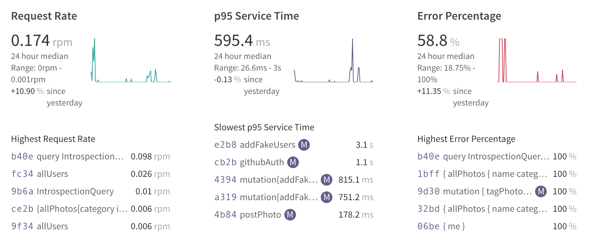

# Photo sharing app based on a GraphQL backend

This application is created to help people learn about GraphQL. 

It tries to implement most aspects of the GraphQL standard: queries, mutiations and subscriptions.

You can use this repo to build the application yourself, or you can use the hosted version available on Heroku.

## Frontend and Backend architecture

There are two pieces on this app: the backend and the frontend.

The backend piece is a **nodejs** and **Express.js** application using **Apollo** libraries to implement a GraphQL server

The [typeDefs.graphql](photo-share-api/typeDefs.graphql) file is hosting the GraphQL Schema which represents the API contract between the frontend and the backend

The backend also publishes the `/playground` endpoint which allows to interact with the GraphQL API and allows to test the API without having a frontend

On the other side, the frontend is a simple **React** application which is interacting with the API. We are also leveraging [Apollo client](https://www.apollographql.com/docs/react/) 
libraries which allows to seamlessly call graphQL apis on an app without having to deal with HTTP directly. 

Besides, the apollo libraries also allows us to deal with Websockets and dyanmic subscriptions in a simple way

The frontend application is not having any CSS and therefore does not have any design. That is because it allows to keep the code focused only on the GraphQL side and how to wire up graphQL with an app

This is an app made for learning, hence with minimal extra code

## Heroku Hosting

There are two URLs used in Heroku: one for the frontend and one for the graphQL backend
Frontend URL: https://photo-client.herokuapp.com
backend URL: https://photo-graphql.herokuapp.com/playground

The backend URL is just a graphQL api. But the /playground route is providing a GraphQL Playground where you can easily interact, test and look at the documentation of GraphQL API.
This is a great way to understand the API and its capabilities

## Running the app Localy

The repo is containing both the frontend and the backend part, each in their own directory

### Backend: graphQL API

Run the following commands on a shell:

```bash
cd photo-share-api
npm install
touch .env
vi .env
npm start
```
The .env should contain all the environment variable in order to run the app. It should have the following value

| Env variable  | Role                                                  |
| ------------- | ----------------------------------------------------- |
|CLIENT_ID      |The Github application id used to perform github login |
|CLIENT_SECRET  |The Github secret id used to perform github login      |
|DB_HOST        |The Mongo Database url, including its username and password |
|ENGINE_API_KEY |Apollo Engine Api Key to allow for analytics and graphQl metrics |

The application should provide a graphQL backend on `localhost:4000`

### Frontend: React application

This is a classic CRA application. Run the following commands on a shell:

```bash
cd photo-share-client
npm install
npm start
```

To run the app locally, you'll need to manually update the `environment.ts` file to export the dev URLs on it:

```javascript
const prod_environment = {
    production: true,
    backendUrl: "https://photo-graphql.herokuapp.com",
    backendAPIUrl: "https://photo-graphql.herokuapp.com/graphql",
    backendSubsUrl: "wss://photo-graphql.herokuapp.com/graphql",
    githubClientId : "cda005db3c42c2fd596c"
}

export const environment = {
    production: false,
    backendUrl: "http://localhost:4000",
    backendAPIUrl: "http://localhost:4000/graphql",
    backendSubsUrl: "ws://localhost:4000/graphql",
    githubClientId : "3f53bc1a3b4d71d94d15"
}

```

Your application should be runnable through the browser at URL `localhost:3000`


## GraphQL Features implemented
This app is there to showcase a list of graphQL features that we will describe here

### Queries & mutations

Of course, the basics features of graphQl are indeed available.
It should be noted that the graph allows infinite depth of queries, because you can list all the users, then retrieve the photos in which they were tagged, and then list all tagged users from each photos

This is the concept of a graph and is a nice feature to test on the playground: 

```graphql
query deepQuery {
  allUsers{
    githubLogin
    inPhotos{
      name
      taggedUsers{
        githubLogin
        postedPhotos{
          name
          description
          postedBy{
            name
            inPhotos{
              name
            }
          }
        }
      }
    }
  }
}
```

### Subscriptions

Subscriptions are a way to be notified of backend changes automatically, without having to request manually. 

For example, you can make a change from the playground and the app will automatically update itself, without having to refresh the page on the browser

Under the hood, this feature is using Websockets and are implemented with the help of the Apollo libraries

### Mocks

Working with GraphQL in a *Schema Driven Development* approach allows to create a contract between the frontend and the backend team.

This contract can then be implemented very quickly using mocks, which is a feature available from Apollo Server out of the box:

By default, the mocks are returning default random number for numeric types or "Hello World" text for String types. You can easily customize this behaviour so that your mocks become closer to your real data:

```javascript
const mocks = {
    Query: () => ({
        totalPhotos: () => 42,
        allPhotos: () => new MockList([5, 10]),
    }),
    Photo: () => ({
        name: 'sample photo',
        description: null
    })
}

const server = new ApolloServer({
    typeDefs,
    resolvers,
    mocks
})

```

### Security & query limits
Because GraphQL is an API allowing undirected graphs, it can potentially yield to very deep and complex queries. Usually the backend will put a limit on the complexity of the query to avoid the backend to crash

This is also a matter of security. You can specify the *query complexity* or the *query depth* on the server to reject queries which are too complex:

In the application, there is a depth limit of 5 and a query complexity of 1200. If you monitor the backend logs, you'll see the actual query cost for every query you make

```javascript
validationRules: [
            depthLimit(5),
            createComplexityLimitRule(1200, {
                onCost: cost => console.log('query cost: ', cost)
            })
        ],

```

### Apollo engine: analytics and metrics

Finally, apollo engine is enabled in the app (you will need to setup your own apollo engine api key in case you want to test it manually)

Apollo engine provides a collection of metrics on your GraphQL backend with performance metrics, security issues.



This is a must have when you are serious about working in GraphQL
